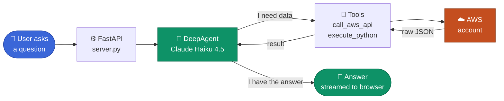
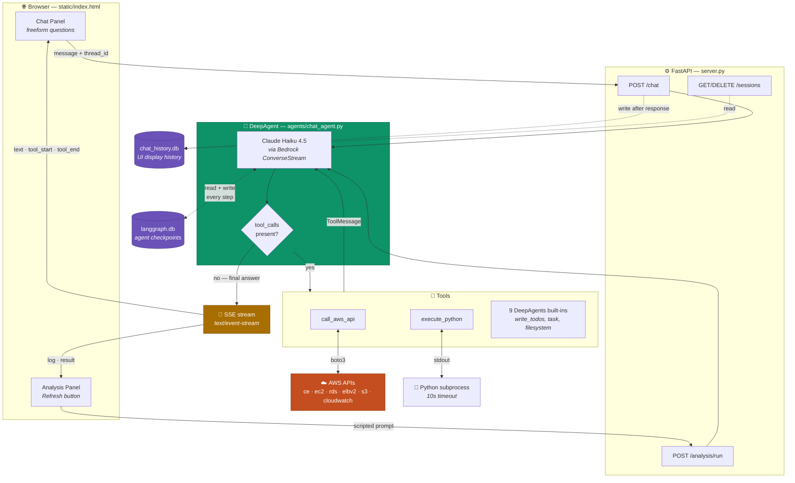
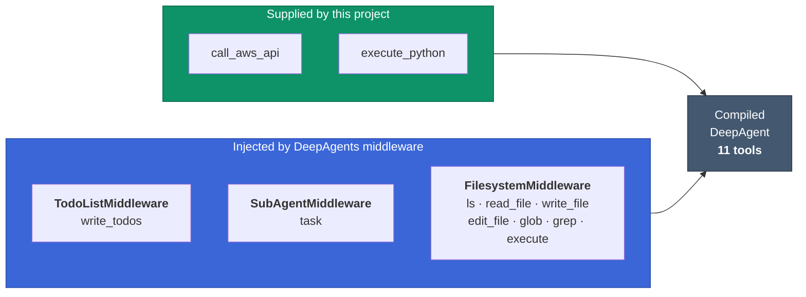
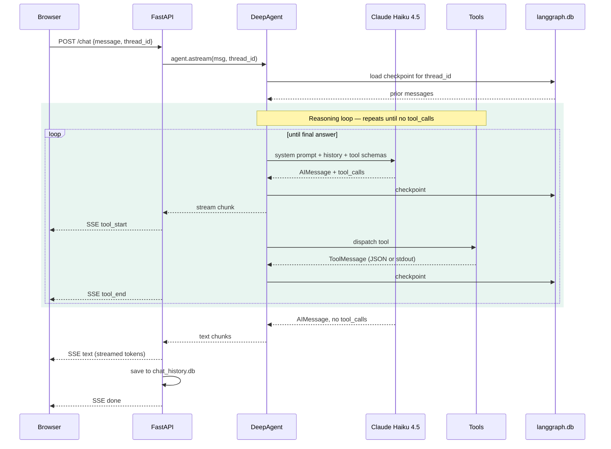
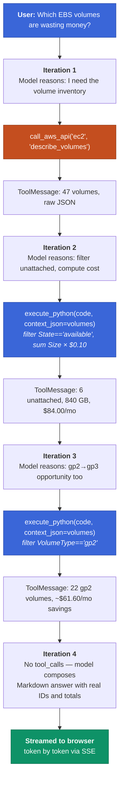
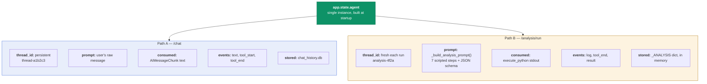
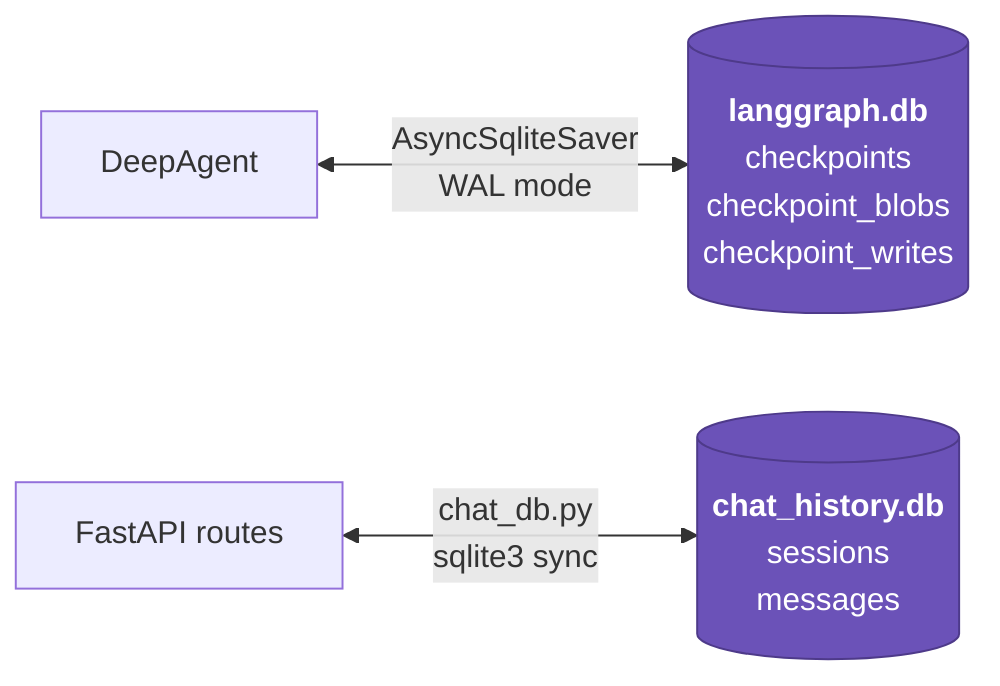

# Architecture — AWS Cloud Cost Advisor

How a natural-language question becomes an answer grounded in live AWS data, and
what the DeepAgents framework contributes to that flow.

## At a glance



The agent loops between **think** and **call a tool** as many times as it needs, then
answers. Everything below is that loop in more detail.

---

- [1. Design thesis](#1-design-thesis)
- [2. System architecture](#2-system-architecture)
- [3. What `create_deep_agent` builds](#3-what-create_deep_agent-builds)
- [4. The reasoning loop](#4-the-reasoning-loop)
- [5. Worked example](#5-worked-example)
- [6. Two request paths, one agent](#6-two-request-paths-one-agent)
- [7. Persistence](#7-persistence)
- [8. Design trade-offs](#8-design-trade-offs)

---

## 1. Design thesis

**Two universal tools instead of dozens of specific ones.**

A conventional AWS cost tool hardcodes one function per question: `get_ec2_costs()`,
`find_unattached_volumes()`, `check_rds_rightsizing()`. Every new question needs new code.

This system ships exactly two domain tools:

| Tool | What it does |
|---|---|
| `call_aws_api(service, operation, params)` | Any boto3 operation on any AWS service |
| `execute_python(code, context_json)` | Arbitrary Python over the JSON that came back |

Together they span the entire AWS API surface plus arbitrary computation over the
results. The agent composes them at runtime to answer questions nobody wrote code for.
"Which gp2 volumes should be gp3?" and "project my Q3 spend if I stop the dev fleet"
both work without a code change — the reasoning that used to live in Python now lives
in the model's tool-selection loop.

**DeepAgents supplies the loop.** The project does not implement agent orchestration.
`create_deep_agent()` provides the reason → call tool → observe → repeat cycle, plus
planning and scratchpad capabilities, and LangGraph persists every step.

---

## 2. System architecture



**Layers**

| Layer | File | Responsibility |
|---|---|---|
| UI | `static/index.html` | Chat panel + analysis panel, SSE consumption, Markdown rendering |
| Server | `server.py` | Routing, SSE framing, analysis-JSON extraction, session CRUD |
| Agent | `agents/chat_agent.py` | Model config, system prompt, tool registration |
| Tools | `tools/aws_api.py`, `tools/python_repl.py` | AWS access, computation |
| Persistence | `chat_db.py` + LangGraph checkpointer | Two SQLite databases |

---

## 3. What `create_deep_agent` builds

The call in [`agents/chat_agent.py:89`](../agents/chat_agent.py#L89) is deliberately minimal:

```python
create_deep_agent(
    model=model,                 # ChatBedrockConverse — Claude Haiku 4.5
    tools=_TOOLS,                # [call_aws_api, execute_python]
    checkpointer=checkpointer,   # AsyncSqliteSaver → langgraph.db
    system_prompt=_SYSTEM_PROMPT + context_block,
)
```

Four arguments. DeepAgents 0.6.12 expands that into a compiled LangGraph state machine
with **11 registered tools** — the 2 supplied plus 9 injected by default middleware:



| Middleware | Tools added | Purpose in this system |
|---|---|---|
| `TodoListMiddleware` | `write_todos` | Agent plans multi-step work before executing — used heavily on the 7-step analysis run |
| `FilesystemMiddleware` | `ls`, `read_file`, `write_file`, `edit_file`, `glob`, `grep`, `execute` | Virtual scratchpad for staging intermediate results between steps |
| `SubAgentMiddleware` | `task` | Spawn an isolated sub-agent with its own context window |
| `PatchToolCallsMiddleware` | — | Repairs malformed tool calls instead of failing the turn |
| `AnthropicPromptCachingMiddleware` | — | Caches the large static system prompt across turns, cutting token cost |

**Architectural consequence.** Because 9 tools arrive uninvited, the frontend progress
log cannot simply count `tool_end` events — a `write_todos` call would corrupt the
step counter. The UI therefore filters to `call_aws_api` and `execute_python` only.
The same holds for the analysis log in [`server.py:358`](../server.py#L358).

> **Note.** `task` and `execute` are registered but not exercised by current prompts.
> `execute` in particular is a shell-execution capability that is present and reachable —
> worth knowing about when reviewing the trust boundary.

---

## 4. The reasoning loop

This is the heart of the system — where "DeepAgent" earns its place.



**Loop mechanics**

1. **Context assembly** — the checkpointer rehydrates the full prior conversation for
   this `thread_id`, so turn 5 still knows what turn 1 fetched.
2. **Decision** — the model sees the system prompt (tool docs) plus the account ID,
   region, and today's date prepended fresh to the message on every request — never
   baked into the system prompt itself, since that's built once at process startup
   and would otherwise go stale — and decides which tool to call, or that it has
   enough to answer.
3. **Dispatch** — LangGraph routes to the tool node and appends the result as a
   `ToolMessage`.
4. **Termination** — the loop exits when the model returns an `AIMessage` with no
   `tool_calls`. There is no fixed step limit; the model decides when it is done.
5. **Error recovery** — both tools return errors *as strings* rather than raising.
   A failed boto3 call yields `{"error": "..."}` and a Python exception yields the
   stderr trace, so the model can read the failure and retry with corrected arguments
   on the next iteration. This is why the loop is resilient without try/catch in the
   server.

---

## 5. Worked example

**Question:** *"Which of my EBS volumes are wasting money?"*



Nothing in the codebase knows what an "unattached volume" is. The model derived the
concept, wrote the filter, applied a price, and assembled the answer — three tool calls,
zero domain-specific code.

---

## 6. Two request paths, one agent

The agent is built **once** at server startup ([`server.py:53`](../server.py#L53)) and stored
as `app.state.agent`. Both endpoints call `.astream()` on that same object. Three things
differentiate them:



**Why a fresh thread for analysis.** Because LangGraph loads context keyed by
`thread_id`, the analysis run starts with **zero prior context** — it never sees your
chat, and your chat never sees it. The analysis needs a deterministic, repeatable run,
not whatever you happened to ask ten minutes earlier.

**Why the prose is discarded.** The analysis endpoint reads the `execute_python`
ToolMessage content — not the model's narration — and parses JSON out of it
([`server.py:370`](../server.py#L370)). The prompt ends with *"execute_python must be your
FINAL action. Print ONLY the JSON."* Three fallback parse strategies handle the cases
where the model wraps it in a code fence or adds commentary anyway.

---

## 7. Persistence

Two SQLite databases in the project root, serving two different consumers.



| | `langgraph.db` | `chat_history.db` |
|---|---|---|
| Owner | LangGraph library | This project (`chat_db.py`) |
| Format | Serialized binary blobs | Plain text SQL rows |
| Purpose | Rebuild agent context | Render the history sidebar |
| Written | Every message and tool step | After each completed response |
| Read by | `AsyncSqliteSaver` before each `astream()` | `GET /sessions`, `GET /sessions/{id}/messages` |

They cannot be merged: the sidebar needs human-readable message text, and extracting
that from LangGraph's internal blob format would mean deserializing library internals
that change between releases.

Both are auto-created on first run and listed in `.gitignore`.

> **Known gap.** Each analysis run creates an `analysis-*` thread that is never deleted —
> the delete endpoints only clean up threads removed from the chat sidebar. `langgraph.db`
> accumulates orphaned analysis checkpoints over time.

---

## 8. Design trade-offs

**What this architecture buys**

- New questions need no new code — the tool surface already spans all of AWS
- One system prompt is the entire "business logic"; behaviour changes are prompt edits
- Tool errors become model input rather than crashes, so the loop self-corrects
- Adding a service means nothing: `call_aws_api("kinesis", ...)` already works

**What it costs**

- **Non-deterministic** — the same question may take a different tool path each run,
  which is why evaluation needs seeded fixtures and multi-run scoring rather than
  single-shot assertions
- **Unbounded blast radius** — `call_aws_api` has no operation allowlist
  ([`tools/aws_api.py:47`](../tools/aws_api.py#L47) does `getattr(client, operation)`), so
  IAM policy is the only thing preventing a destructive call
- **`execute_python` is not sandboxed** despite its docstring — it is a plain
  `subprocess.run` sharing the user, environment, filesystem, and network, with AWS
  credentials in scope. The 10-second timeout is the only limit.
- **Latency and token cost scale with iteration count**, and the model chooses that count

**The alternative that was replaced.** An earlier design used a master orchestrator
delegating to eight specialist sub-agents (EC2, EBS, RDS, S3, Network, Savings, Lambda,
CloudWatch) with roughly ten tool modules. That structure is still described in
`README.md`, which is now stale. It was more predictable but required a code change for
every new question — the two-universal-tools design trades that predictability for
open-ended coverage.

---

## Related documents

- [`TECHNICAL.md`](TECHNICAL.md) — implementation reference: routes, SSE event tables, schemas
- [`Infra.md`](Infra.md) — deployment architecture: AWS resources, IAM, network, redeploy process
- [`../static/deepagent-flow.html`](../static/deepagent-flow.html) — the same flow as a rendered visual page
