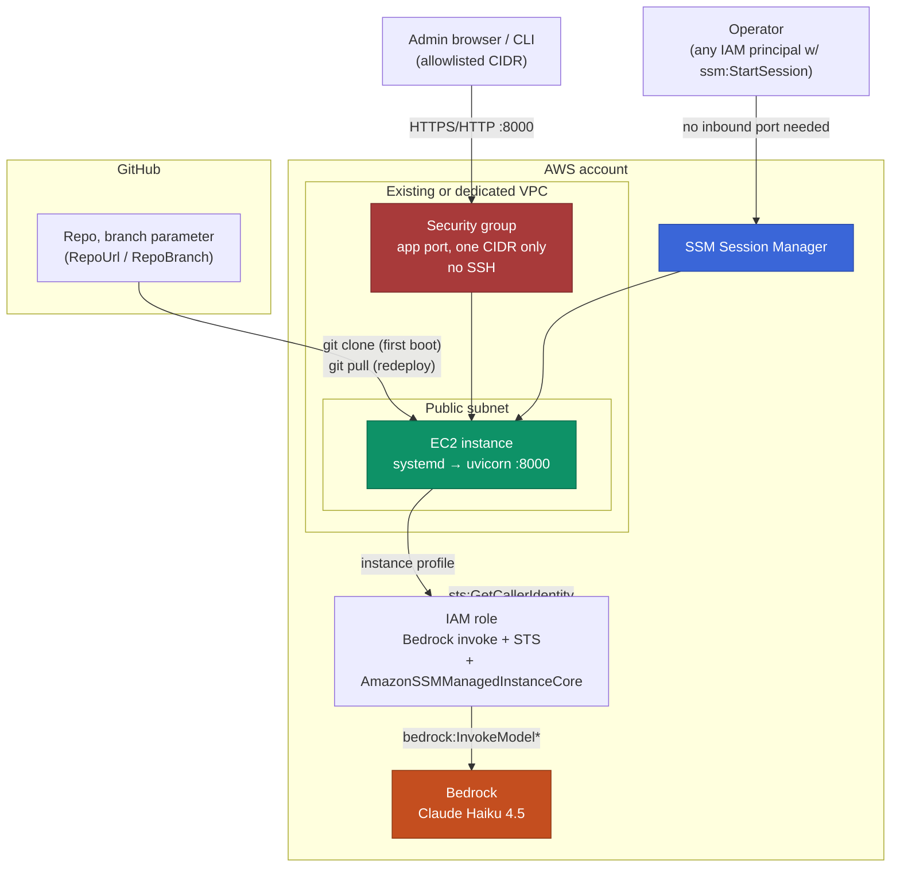

# Infrastructure — AWS Cloud Cost Advisor

How this app is deployed and run in AWS: what gets created, how access is
controlled, and how to ship a code change to a running instance. Complements
[`Architecture.md`](Architecture.md) (the *application's* design) with the
*deployment's* design.

Concrete resource identifiers (account ID, instance ID, VPC ID, IP) are
deliberately left out of this file — this repo is public, and there's no
reason to publish exact live topology for a real running system. Anyone
redeploying gets those values back from their own `aws cloudformation
describe-stacks` output.

---

- [1. Deployment model](#1-deployment-model)
- [2. What gets created](#2-what-gets-created)
- [3. Network](#3-network)
- [4. Access — no SSH](#4-access--no-ssh)
- [5. IAM — two separate identities](#5-iam--two-separate-identities)
- [6. Secrets](#6-secrets)
- [7. Architecture diagram](#7-architecture-diagram)
- [8. Redeploying a code change](#8-redeploying-a-code-change)
- [9. Durability and backup](#9-durability-and-backup)
- [10. Known limitations](#10-known-limitations)

---

## 1. Deployment model

**Single EC2 instance, managed as one CloudFormation stack.** Not an
auto-scaling group, not multiple instances behind a load balancer — see
[`Architecture.md`'s design trade-offs](Architecture.md#8-design-trade-offs)
for why: login sessions (`auth.py`) and analysed-account AWS credentials
(`credentials.py`) live in an in-process Python dict, and `langgraph.db` /
`chat_history.db` are local SQLite files. None of that survives a second
instance without first moving sessions to something like Redis and swapping
SQLite for a networked database. Until that work happens, one instance is
the honest answer, not a stopgap.

The template is [`deploy/cost-advisor-stack.yaml`](../deploy/cost-advisor-stack.yaml).
Everything below describes what it builds and why.

---

## 2. What gets created

| Resource | Purpose |
|---|---|
| IAM role + instance profile | Lets the instance call Bedrock and STS without any keys on disk |
| Security group | One inbound rule: the app port, from a single allowlisted CIDR. No SSH port. |
| EC2 key pair | Created for optional future direct SSH; not required for normal access (see §4) |
| EC2 instance (`t3.small` default) | Runs the app under systemd; `UserData` bootstraps it on first boot |

One stack, one `create-stack`, one `delete-stack`. No ALB, no ACM
certificate, no Route 53 — TLS is deliberately deferred (see §10); adding it
later means adding those three, not restructuring anything above them.

`UserData` runs once, on first boot only: installs Python 3.12 and git,
clones the app from the repo/branch given as template parameters, creates a
venv, installs dependencies, generates a random `AUTH_PASSWORD` **on the
instance** (never as a CloudFormation parameter — see §6), writes `.env`,
and starts the `cost-advisor` systemd unit.

## 3. Network

The account this was first deployed into had **no default VPC and no
general-purpose shared VPC** — every existing VPC belonged to a specific
other team's project, and the account was already at its VPC-per-region
quota. Rather than either request a quota increase or provision a redundant
VPC that would have nowhere to go, the template takes an existing VPC's
public subnet as parameters (`VpcId`, `PublicSubnetId`) instead of creating
its own network.

**If your account has a default VPC or you'd rather provision a dedicated
one**, that's a small template change: replace the `VpcId`/`PublicSubnetId`
parameters with `AWS::EC2::VPC`, `AWS::EC2::Subnet`, `AWS::EC2::InternetGateway`,
`AWS::EC2::VPCGatewayAttachment`, and `AWS::EC2::Route` resources, and point
the security group and instance at those instead. The template's structure
doesn't otherwise change.

The security group allows exactly one thing: the app's port, from one CIDR
(a template parameter, no default — you supply it). Nothing else is open,
inbound or otherwise scoped.

## 4. Access — no SSH

Shell access is via **SSM Session Manager**, not SSH:

- The instance role carries the AWS-managed `AmazonSSMManagedInstanceCore`
  policy — that's the only permission Session Manager needs.
- No inbound port 22 in the security group. There's nothing to scan, brute
  force, or leave open by accident.
- A key pair is still created (`AWS::EC2::KeyPair`), for anyone who wants
  conventional SSH later — CloudFormation stores its private key
  automatically in SSM Parameter Store (`/ec2/keypair/{KeyPairId}`), so it's
  retrievable without having been emailed around or committed anywhere.

To connect: EC2 console → instance → **Connect** → **Session Manager** tab.
Or `aws ssm start-session --target <instance-id>` from a CLI with
`ssm:StartSession` permission. The default session user (`ssm-user` on
Amazon Linux) isn't the app's file owner (`ec2-user`), so reading
`/opt/cost-advisor/.env` needs `sudo`.

## 5. IAM — two separate identities

Two IAM policies live in [`deploy/`](../deploy/), scoped to two different
AWS identities that must never be confused:

| | [`iam-policy-deployment-account.json`](../deploy/iam-policy-deployment-account.json) | [`iam-policy-analysed-account.json`](../deploy/iam-policy-analysed-account.json) |
|---|---|---|
| Attached to | The EC2 instance role (this stack) | A role in whatever AWS account a signed-in user connects for analysis |
| Grants | `bedrock:InvokeModel*`, `sts:GetCallerIdentity` | Read-only inventory/cost/billing actions across ~10 services, plus explicit `Deny` statements as a backstop against mutation and credential exfiltration |
| Never used for | Reading anything in the analysed account | Anything the deployment does — this role isn't attached to the instance at all |

The analysed-account policy is the real security boundary for the chat
agent: `tools/aws_api.py`'s `call_aws_api` allows any `describe_*`/`get_*`/
`list_*`/… call on any service by name, so IAM — not application code — is
what actually limits what the agent can read. See
[`Architecture.md`'s design trade-offs](Architecture.md#8-design-trade-offs)
for the full reasoning.

## 6. Secrets

Nothing sensitive travels through CloudFormation:

- **`AUTH_PASSWORD`** is generated with `openssl rand` *inside* `UserData`,
  after the instance is already running — never a stack parameter, never a
  stack output, never in `describe-stacks`. The one time this project
  generated a password and then *echoed* it via `bash -x` tracing into a
  log file, that password was immediately treated as burned and rotated —
  worth remembering if you ever hand-edit the bootstrap script: keep
  `set +x` around anything that touches a secret.
- **Analysed-account AWS credentials** never touch this instance's
  filesystem or environment at all — they're entered through the UI per
  login session and held in `credentials.py`'s in-memory store. A restart
  clears them; that's intentional.
- **The deployment role's own credentials** are never on disk either — the
  instance profile supplies them to boto3 automatically.

To read or rotate `AUTH_PASSWORD` after deployment, see
[`README.md`'s login section](../README.md) — short version: connect via
Session Manager, `sudo cat /opt/cost-advisor/.env`, or overwrite the file
and `systemctl restart cost-advisor`. Retrieval should happen in a session
only you can see — not relayed through a shared chat/ticket/log, for the
same reason the password isn't a stack output.

## 7. Architecture diagram



The **analysed AWS account** — whichever account a signed-in user pastes
credentials for through the UI — is intentionally absent from this diagram.
It isn't part of the deployment; it's runtime input the app receives per
login session, over the same `:8000` connection, and is covered in
[`Architecture.md`](Architecture.md) instead.

## 8. Redeploying a code change

CloudFormation provisions the instance once; it does not track or redeploy
application code — `UserData` only runs on first boot. Shipping a code
change is a separate, lighter step:

```bash
# 1. Push the change
git push origin <branch>

# 2. On the instance (via SSM):
cd /opt/cost-advisor
sudo -u ec2-user git pull
sudo -u ec2-user .venv/bin/pip install -r requirements.txt   # only if requirements.txt changed
sudo systemctl restart cost-advisor
sudo systemctl is-active cost-advisor                         # confirm it's active, not failed
```

This is a hard cutover — `systemctl restart` drops any in-flight chat or
analysis SSE stream. There's no rolling deploy with a single instance and no
load balancer to route around it.

## 9. Durability and backup

The `Instance` resource carries `DeletionPolicy: Snapshot`, so an ordinary
`delete-stack` snapshots the root EBS volume — and with it `langgraph.db`
and `chat_history.db` — before removing it. That protects against
accidental stack deletion; it does **not** replace a real backup schedule.
For that, an EBS Data Lifecycle Manager policy (e.g. daily snapshot, retain
7) is the natural next step and isn't part of this stack today.

## 10. Known limitations

- **No TLS.** `COOKIE_SECURE=false`, plain HTTP. The login form and the
  AWS-credentials panel both submit over an unencrypted connection — an
  explicit, discussed trade-off for a small-audience deployment, not an
  oversight. Layering TLS on later means an ALB + ACM certificate (or
  nginx + certbot on-box) in front of the existing instance — see
  [`deploy/DEPLOYMENT.md`](../deploy/DEPLOYMENT.md) for both options in
  detail.
- **Single instance, no HA.** Covered in §1 — the blocker is the app's
  in-memory session/credential state, not the infrastructure.
- **The security group's source CIDR is a single IP by default.** Fine for
  one operator; if more people need access, it becomes a small list of
  CIDRs, not `0.0.0.0/0` — the app's own login form is the only thing
  standing between an open port and live AWS credentials someone might
  paste into it.
